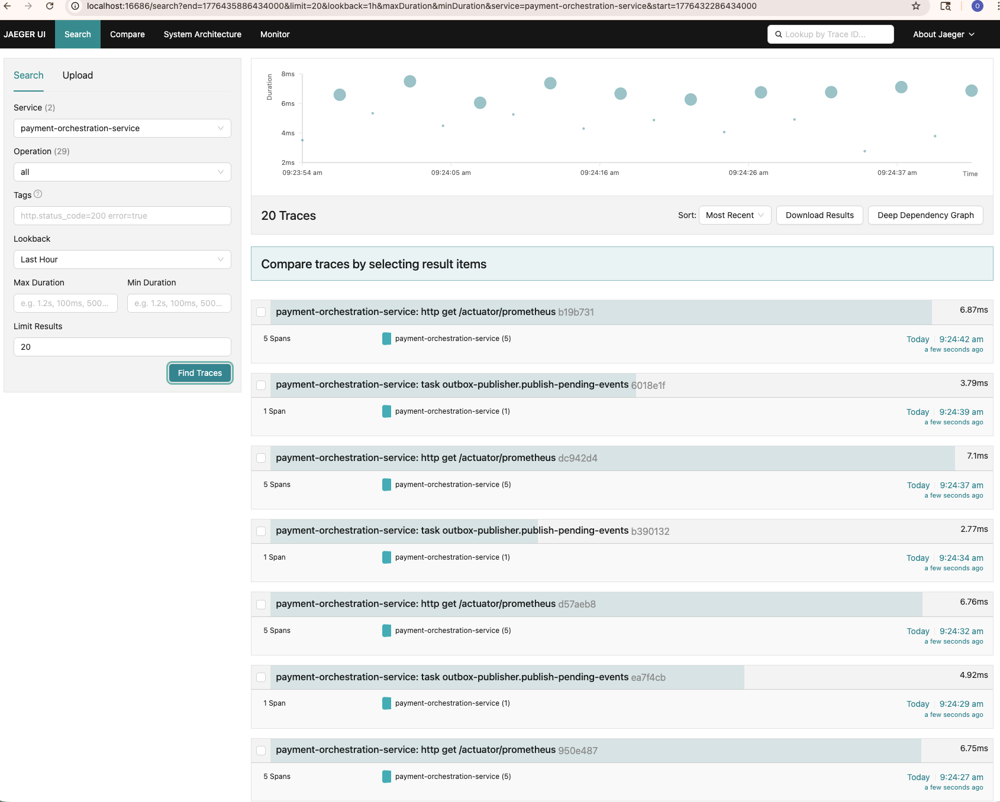
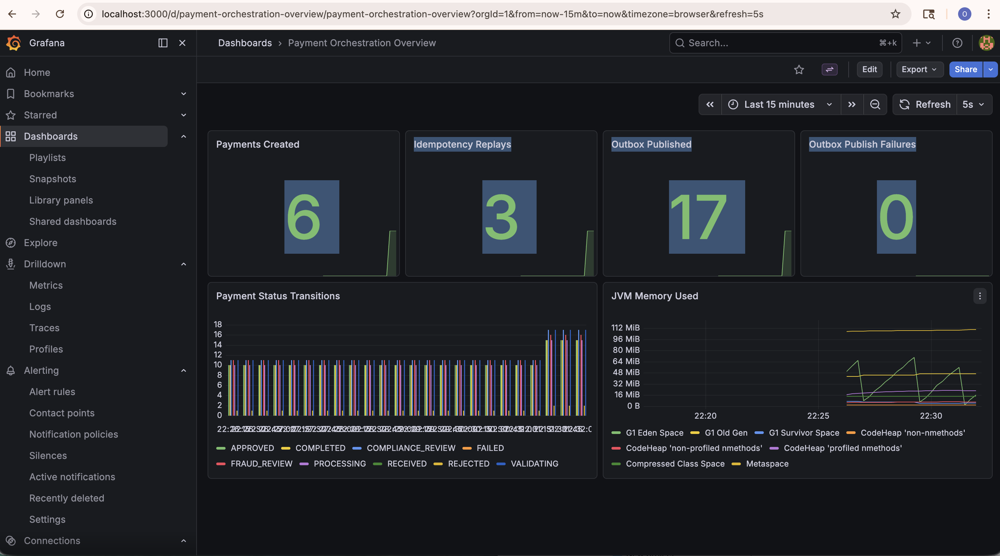
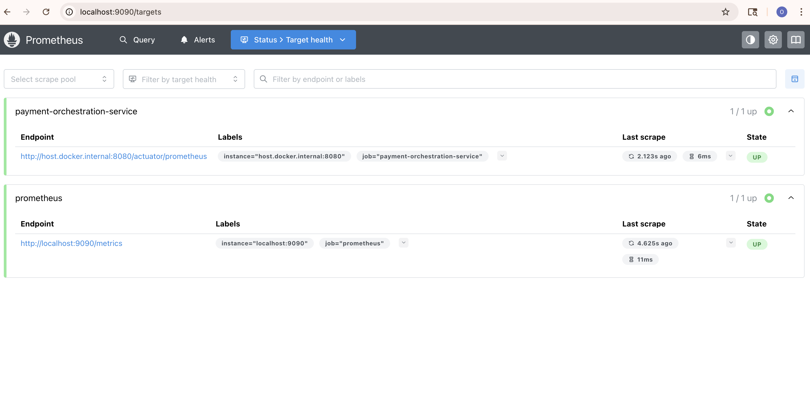

# Enterprise AI-Powered Payment Orchestration Platform

Production-style payment orchestration platform built with Java 21 and Spring Boot to demonstrate how modern payment systems handle secure API intake, idempotent transaction creation, AI-assisted fraud and compliance decisions, reliable event publication, and observable asynchronous workflows.

This project models the kind of backend architecture used in regulated transaction systems: payments are accepted through a secured REST API, persisted with idempotency guarantees, published through the outbox pattern, processed asynchronously through Kafka-driven orchestration, and tracked with metrics and tracing.

## Why this project stands out

- AI-assisted orchestration flow for fraud and compliance decisioning
- Idempotent payment creation to prevent duplicate transaction processing
- Outbox pattern for reliable event publishing between database and Kafka
- Event-driven architecture with DLT-based failure handling
- JWT/OAuth2-ready API security with a local developer mode
- Flyway-managed schema migrations for repeatable database evolution
- OpenTelemetry tracing and Prometheus metrics for operational visibility
- Integration test coverage with Testcontainers for realistic system validation

## Technical highlights

- REST API for payment intake and retrieval
- Spring Security configuration for JWT resource server flows
- PostgreSQL persistence for payments and outbox events
- Kafka producers and consumers for payment lifecycle events
- AI decision records and anomaly detection test coverage
- Fraud scoring, compliance screening, and orchestration decision services
- OpenAPI support for API discoverability
- Prometheus and tracing instrumentation for production-style observability

## Architecture flow

1. A client submits a payment request through the API.
2. The service validates the request and enforces idempotency.
3. The payment and corresponding outbox event are stored transactionally in PostgreSQL.
4. The outbox publisher sends the event to Kafka.
5. Downstream orchestration evaluates validation, fraud, and compliance outcomes.
6. The payment is approved, rejected, or failed, and lifecycle events are emitted.
7. Dead-letter handling captures failed consumer scenarios for recovery and visibility.

## High-level architecture

```text
Client
  -> REST API / Payment Controller
  -> Payment Service
  -> PostgreSQL (payments, outbox_events)

Outbox Publisher
  -> Kafka topic: payment.received

Kafka Consumer / Orchestration
  -> validation
  -> compliance review
  -> fraud review
  -> approve / reject / fail
  -> publish payment.processed or payment.rejected

DLT Consumer
  -> handles failed consumer events
  -> marks payment as FAILED
```

## Screenshots

<p align="center">
  <a href="./target.png">
    
  </a>
  <a href="./grafana-dashboard.png">
    
  </a>
  <a href="./prometheus.png">
    
  </a>
</p>

## Stack

- Java 21
- Spring Boot 3
- Spring Security OAuth2 Resource Server
- PostgreSQL
- Apache Kafka
- Flyway
- OpenTelemetry
- Prometheus and Grafana
- Testcontainers
- Maven

## Running the service

Default startup expects these external dependencies to be available:

- PostgreSQL on `localhost:5432`
- Kafka on the configured bootstrap servers
- A JWT issuer on `http://localhost:8180/realms/payment-platform`

By default, local startup does not require a bearer token.
If you want JWT enforcement enabled, start the app with `APP_SECURITY_ENABLED=true` and send a token from the configured issuer.

For a self-contained local boot without external infrastructure, use the `local` profile:

```bash
mvn -Dtest=LocalProfileApplicationTest test
mvn -DskipTests package
java -jar target/payment-orchestration-service-1.0.0.jar --spring.profiles.active=local
```

You can also keep the default profile and disable auth temporarily:

```bash
APP_SECURITY_ENABLED=false java -jar target/payment-orchestration-service-1.0.0.jar
```

To run with auth enabled:

```bash
APP_SECURITY_ENABLED=true java -jar target/payment-orchestration-service-1.0.0.jar
```

Keycloak bootstrap:

- `docker-compose.yml` imports `infra/keycloak/payment-platform-realm.json`
- realm: `payment-platform`
- client: `payment-cli`
- test user: `payment-user`
- test password: `paymentpass`

Example token request:

```bash
curl -X POST http://localhost:8180/realms/payment-platform/protocol/openid-connect/token \
  -H 'Content-Type: application/x-www-form-urlencoded' \
  -d 'grant_type=password' \
  -d 'client_id=payment-cli' \
  -d 'username=payment-user' \
  -d 'password=paymentpass'
```
